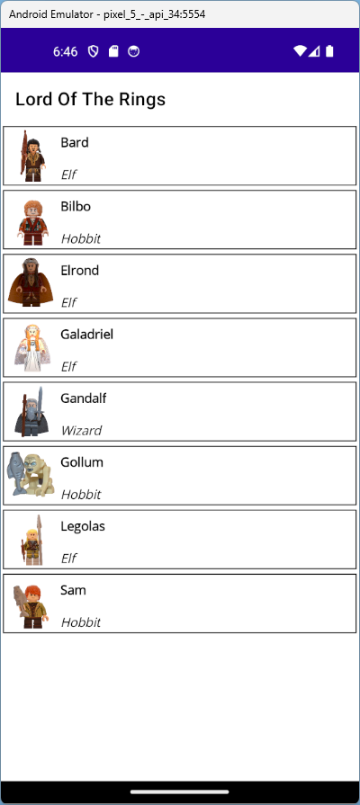
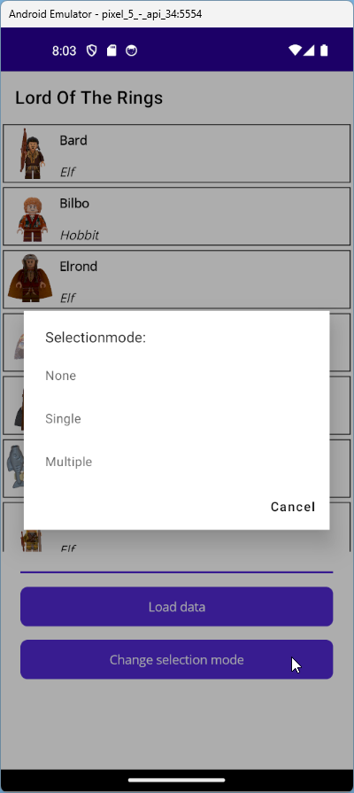
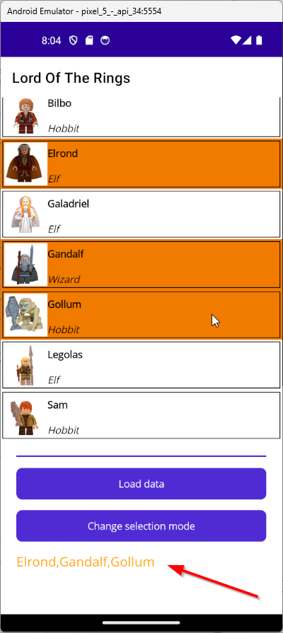
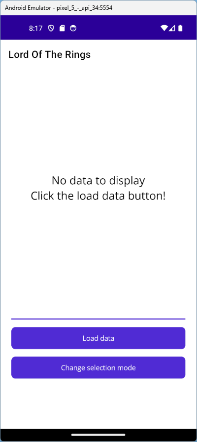
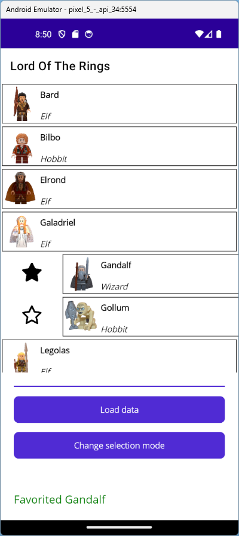

# Labo - CollectionView
## Deel 1
- Voeg een CollectionView toe aan de MainPage van de applicatie.
- Geef de CollectionView een naam: ```charactersCollectionView```.
- Gebruik de ```GetData()``` functie in de MainPage.xaml.cs klasse om een generieke lijst van characters op te halen.
- Gebruik de ```ItemsSource``` property van de CollectionView om de lijst van characters te gebruiken als databron.
    > Tip: Doe dit in de constructor van de MainPage.
- Bekijk het resultaat in de applicatie.

## Deel 2
- Gebruik nu de ```DataRepository.GetAllCharacters()``` functie (in plaats van de *GetData()*) om een generieke lijst van characters op te halen.
- Bekijk het resultaat in de applicatie.

## Deel 3
- Overschrijf de ```ToString()``` functie van de *MiniFig* klasse om de weergave in de CollectionView aan te passen. Retourneer de *Name* en *Race* eigenschap van elk object.
- Bekijk het resultaat in de applicatie.

## Deel 4
- Voeg een *ItemTemplate* met *DataTemplate* toe aan de CollectionView:
```
<CollectionView x:Name="charactersCollectionView">
    <CollectionView.ItemTemplate>
        <DataTemplate>
                    
        </DataTemplate>
    </CollectionView.ItemTemplate>
</CollectionView>
```
- Voeg een GridLayout toe aan de DataTemplate met 2 rijen en 2 kolommen.
- Voeg een Image toe aan de GridLayout. Deze image...
    - staat in de eerste kolom met een rowspan van 2
    - heeft een breedte en een hoogte van 60
    - heeft een aspect property met waarde *AspectFill*
- Gebruik nu databinding om de *ImageUrl* eigenschap van de *MiniFig* klasse te binden aan de *Source* eigenschap van de *Image* klasse:
```
Source="{Binding ImageUrl}"
```
- Voeg een Label toe aan de GridLayout. Dit label...
	- staat in de tweede kolom en eerste rij
	- heeft een tekstkleur van *Black*
	- heeft een fontsize van *Medium*
    - heeft een fontweight van *Bold*
- Gebruik nu databinding om de *Name* eigenschap van de *MiniFig* klasse te binden aan de *Text* eigenschap van de *Label* klasse
```
Text="{Binding Name}"
```
- Voeg een Label toe aan de GridLayout. Dit label...
	- staat in de tweede kolom en tweede rij
	- heeft een tekstkleur van *Black*
	- heeft een fontsize van *Small*
    - bevat cursieve tekst
    - wordt verticaal onderaan uitgelijnd
- Gebruik nu databinding om de *Race* eignschap van de *MiniFig* klasse te binden aan de *Text* eigenschap van de *Label* klasse
```
Text="{Binding Race}"
```
- Voeg nu rond de GridLayout een rand toe door gebruik te maken van het *\<border\>* element
    - Stroke="Black" 
    - StrokeThickness="1" 
    - Margin="2" 
    - Padding="2"



## Deel 5 - Selection
- Voeg een tweede rij toe aan de GridLayout waarin de CollectionView zich bevindt. De onderste rij is even hoog als de inhoud, de eerste rij neemt de overige ruimte in beslag.
- Voeg onderstaande XAML code toe onder de CollectionView:
```
<VerticalStackLayout Spacing="15" Margin="2" Padding="20" Grid.Row="1">
    <BoxView BackgroundColor="{StaticResource Primary}" HeightRequest="2"/>
    <Button Text="Load data" Clicked="OnLoadDataClicked"/>
    <Button Text="Change selection mode" Clicked="OnChangeSelectionModeClicked"/>
    <Label Text="" x:Name="selectionLabel" FontSize="Medium" TextColor="Orange"/>
    <Label Text="" x:Name="favouriteLabel" FontSize="Medium" TextColor="Green"/>
</VerticalStackLayout>
```
- Maak een *OnLoadDataClicked* event procedure en verplaats de logica om een lijst toe te wijzen als databron van de constructor naar deze methode
- Maak een event procedure voor het *Clicked* event van de *Change selection mode* Button:
    - Toon een [action sheet popup](https://learn.microsoft.com/en-us/dotnet/maui/user-interface/pop-ups?view=net-maui-8.0#guide-users-through-tasks) die de gebruiker vraagt welke selectiemodus gebruikt moet worden
    - Gebruik een *switch* om de gekozen action te evalueren
    - Configureer de *SelectionMode* van de CollectionView afhankelijk van de gekozen waarde
- Maak een event procedure voor het *SelectionChanged* event van de CollectionView
    - Toon in het *selectionLabel* de namen van de geselecteerde characters

> Tip: [string.Join()](https://learn.microsoft.com/en-us/dotnet/api/system.string.join?view=net-8.0#system-string-join) + [Cast<>](https://learn.microsoft.com/en-us/dotnet/api/system.linq.enumerable.cast?view=net-8.0) + [Select](https://learn.microsoft.com/en-us/dotnet/api/system.linq.enumerable.select?view=net-8.0)




## Deel 6 - EmptyView
- Configureer de CollectionView zodat 2 Labels worden weergegeven wanneer er geen data "geladen" is in de CollectionView



# Extra
## Deel 7 - SwipeView
- [Documentatie](https://learn.microsoft.com/en-us/dotnet/maui/user-interface/controls/swipeview?view=net-maui-8.0)
- [Tutorial](https://www.youtube.com/watch?v=BHBYHC_9URc)

XAML
```
<CollectionView.ItemTemplate>
    <DataTemplate>
        <SwipeView>
            <SwipeView.LeftItems>
                <SwipeItems>
                    <SwipeItem 
                        IconImageSource="star.svg"
                        Invoked="OnFavoriteSwipeItemInvoked" CommandParameter="{Binding Name}" />
                </SwipeItems>
            </SwipeView.LeftItems>
                        
            <!-- Default content for DataTemplate comes here -->

        </SwipeView>
    </DataTemplate>
</CollectionView>
```
C#
```
private void OnFavoriteSwipeItemInvoked(object sender, EventArgs e)
{
    var swipeview = sender as SwipeItem;
    var item = swipeview.CommandParameter.ToString();
    swipeview.IconImageSource = "solidstar.svg";

    favouriteLabel.Text = $"Favorited {item}";
}
```


## Deel 8 - RefreshView
- Nest de bestaande CollectionView in een *RefreshView* en configureer het *Command* in de constructor van de MainPage.xaml.cs
- Voeg een footer toe aan de CollectionView met daarin een Label *refreshLabel*

> De *RefreshView* werkt met Commands en niet met Events, hierover later meer in het hoofdstuk MVVM

XAML
```
<RefreshView x:Name="refreshView">
    <CollectionView>
        ...
        <CollectionView.Footer>
            <Label Text="Last refresh @ ..." x:Name="refreshLabel" HorizontalTextAlignment="Center" FontSize="Large" TextColor="LightGray"></Label>
        </CollectionView.Footer>
    </CollectionView>
</RefreshView>
```
C#
```
public MainPage()
{
    InitializeComponent();

    ICommand refreshCommand = new Command(() =>
    {
        // Reload data
        charactersCollectionView.ItemsSource = Data.DataRepository.GetAllCharacters();

        refreshLabel.Text = "Refreshed @ " + DateTime.Now.ToShortTimeString();
        refreshView.IsRefreshing = false;
    });
    refreshView.Command = refreshCommand;
}
```


## Bronnen
- [Minifigures](https://losseminifiguren.nl/product-categorie/the-lord-of-the-rings/)
)
